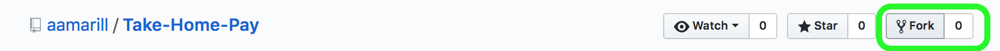

# Take-Home Pay Calculator

A calculator for US federal employees to calculate their take-home pay.

https://take-home-pay.herokuapp.com/

## Installation and configuration
* You need Rails (recommend version 5.1.5 or newer) and Ruby (recommend version
  2.4.1 or newer).

* Fork it on GitHub.

* Run `$ git clone https://github.com/YOUR-USERNAME/Take-Home-Pay` to clone your forked repo onto your computer.

* Run `$ bundle install` to install all necessary gems.

## Submitting Pull Requests
work on it and then push your changes to
your remote forked repo and then use a pull request to submit your proposed
changes to the original repo.

* Database creation
PostgreSQL

* Database initialization

* How to run the test suite

* Services (job queues, cache servers, search engines, etc.)

* Deployment instructions
Heroku

* Updating tax tables

* License
MIT
